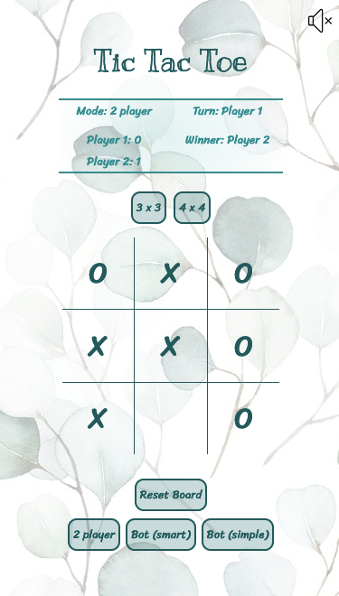

# Tic Tac Toe
Think you're good at Tic Tac Toe?
Think again! 

Try your luck against.. a BOT! 🤖

Beep boop. 

## Getting Started
Check out my Tic Tac Toe game [here](https://berternie9.github.io/tic-tac-toe/)!

You can also check out a video demo below:

## Screenshots
#### Player vs. smart bot (4x4) desktop

#### Two player (3x3) mobile phone

## Technologies used
- Javascript
- HTML
- CSS
- GitHub Pages

## Next steps
- Improve UX for mobile phones
- Include more animations 

## Acknowledgements
- Background music: Ryo Fukui (Scenery 1976) - https://www.youtube.com/watch?v=Hrr3dp7zRQY
- Wallpaper: https://missmofo.com.au/products/bush-leaves-wallpaper?variant=39987579584651